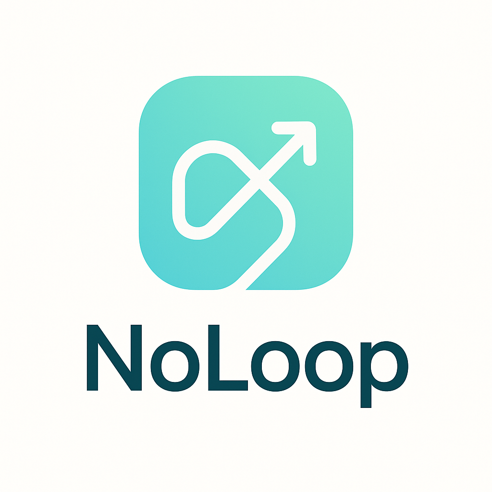

# 🌀 NoLoop

NoLoop is an interactive application built to enhance your wellbeing and productivity.  
Our goal is simple: **help you break the loop**, organize your thoughts, and reconnect with yourself.  

> 📱 **Stop scrolling. Start living.**  
> NoLoop invites you to slow down, reflect weekly, and find clarity in a noisy world.

---

## ✨ Features

- **🧠 BrainDump:** Empty your mind in seconds and get instant mental relief.  
- **📅 Week Organizer:** Define your 1–3 main goals every week and track your progress.  
- **📓 Personal Diary:** Reflect on what went well, what drained you, and how to improve.  
- **🤖 AI Companion:** Smart insights and gentle questions to help you think deeper, not just faster.  
- **🔕 LoopOff Mode:** One tap to silence distractions and regain focus.  

---

## 🏗️ Tech Stack

| Layer      | Technology |
|-----------|-------------|
| **Frontend** | React (TypeScript) |
| **Backend**  | Node.js, Express, TypeScript |
| **Database** | SQLite (lightweight, easy to migrate to Postgres) |
| **Auth**     | JWT-based authentication (planned) |
| **AI**       | OpenAI API (for reflections & insights, planned) |

---

## 🚀 Getting Started (Backend)

### 1️⃣ Clone the repository

```bash
git clone https://github.com/your-username/noloop.git
cd noloop
```

### 2️⃣ Install dependencies

```bash
cd backend
npm install
```

### 3️⃣ Run in development mode

```bash
npm run dev
```

The server will start at **http://localhost:3000**

---

## 📡 API Endpoints (MVP)

| Method | Endpoint     | Description         |
|-------|--------------|-------------------|
| POST  | `/users`     | Create a new user |
| POST  | `/login`     | Authenticate and get token *(coming soon)* |

---

## 🛠️ Project Structure (Backend)

```
backend/
 ├── src/
 │    ├── index.ts        # Server entry point
 │    ├── db.ts           # SQLite connection + migrations
 │    └── routes/
 │         └── users.ts   # User routes (create user)
 ├── breakloop.db         # SQLite database file
 └── package.json
```

---

## 🎯 Roadmap

- [x] Setup SQLite + Express + TypeScript
- [ ] Basic user creation endpoint
- [ ] JWT authentication + login endpoint
- [ ] Week organizer feature
- [ ] BrainDump feature
- [ ] AI-powered weekly review
- [ ] React Native / Web frontend

---

## 🖤 Philosophy

NoLoop is not just another productivity app.  
It’s designed to be **gentle and mindful**, helping you escape autopilot mode and reclaim your attention.  
We believe your time is sacred — so our goal is to help you spend *less* time on your phone, not more.

---

## 🖼️ Logo & Branding

<p align="center">
  
</p>

---

## 🤝 Contributing

Pull requests are welcome!  
If you have ideas to make NoLoop even more mindful and effective, feel free to open an issue.

---

## 📜 License

[GNU GPLv3](./LICENSE)

---

### ⭐ Support the Project

If you believe in helping people find focus and clarity, consider buying me a coffe!

[]([https://www.buymeacoffee.com/gbraad](https://buymeacoffee.com/alexisp))

